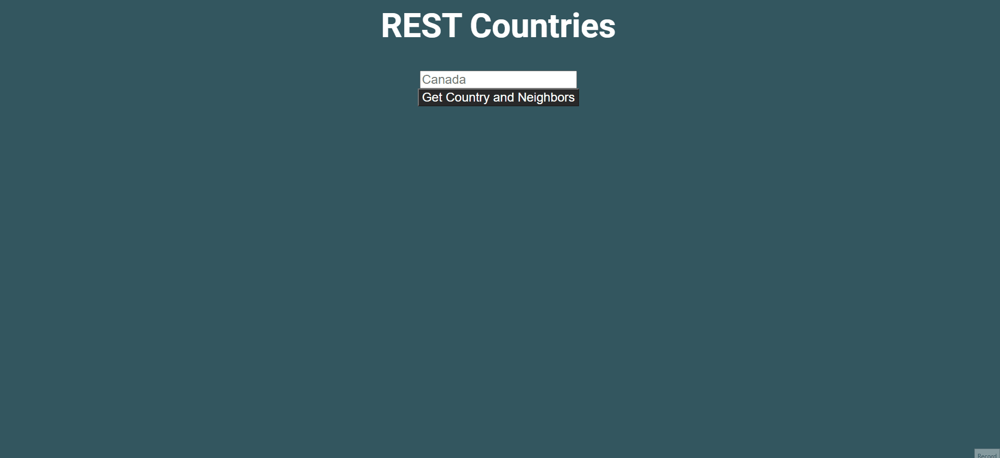

# Neighbor Countries

## From the PDF

A neighboring countries finder built entirely in Javascript and HTML/CSS using the [restcountries API.](https://restcountries.eu/)

## How to run
Simply open `index.html` in your browser

## Notes
- Apparently the REST Countries API only chooses one capital per country even though there are some countries that contain multiple (ex. The South Africa which contains Cape Town, Bloemfontein, and Pretoria)
- Its important to note that some countries don't have neighbors, so had to account for that.
- Added error handling to account for when its an invalid country, it should tell the user
- Extracted only what we need from the api and disregarded the rest.

### How it works
- Fetches world country data in a single go and store a cached hashed version.
- Map the country names -> country alpha codes
- Map the country alpha codes -> country objects

This allows the ability to search for 'Canada' and find the country object. We map the alpha codes as the country
object has an array _borders_ that contains the neighboring country codes. We need
to search by code for O(1) lookup.